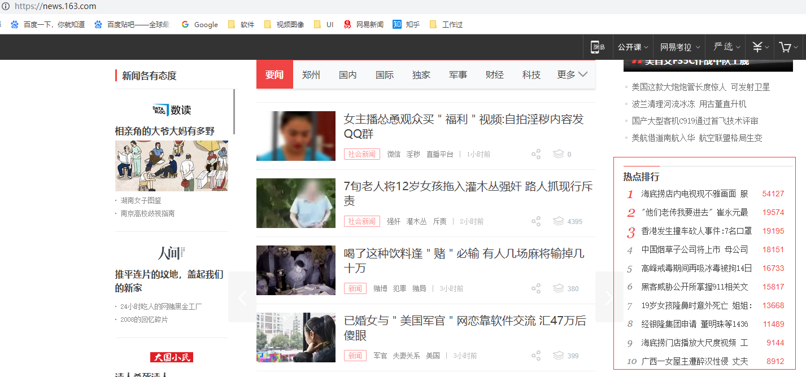
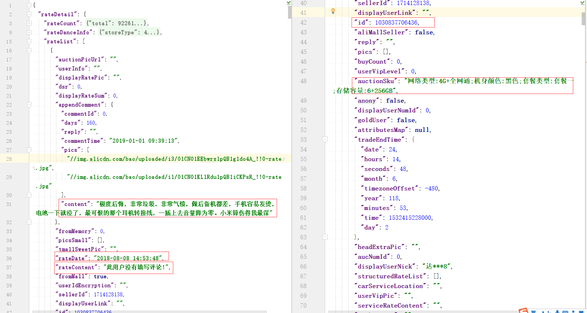

爬虫考试
===
## 静态网站
### 1 网易新闻（满分40）
网址[网易新闻](https://news.163.com/)
要求：
1. 获取网页右侧板块“热点排行”，控制台打印。（请求20 解析20）


### 2 站酷图片下载 （80）
站酷是一个知名设计论坛。下面是两个作品页的网址。
[zcool-1](https://www.zcool.com.cn/work/ZMzI2MTMwNDQ=.html)
[zcool-2](https://www.zcool.com.cn/work/ZMzI2MDM3MTI=.html)
提示：先用第一个网址，开放版权、未禁用鼠标右键，容易分析。
要求：
1. 请求网址，得到html源代码 （20）
2. xpath解析得到图片地址 （20）
3. 请求得到图片二进制，批量将图片保存到本地一个文件夹中 （20）
4. 保存首页列表所有作品集 [zcool](https://www.zcool.com.cn/)，用作品名作为保存的文件夹名字。（20）

## js接口型
### 3 b站 (90）
bilibili是一个知名动漫网站。目标[b站番剧列表页](https://www.bilibili.com/v/anime/serial/)  
  
要求：  
1. 分析返回番剧列表信息的真正请求。用requests包构造请求,得到响应的json数据。（20+10）
2. 爬取第一页信息，控制台print两个字段番剧名、缩略图网址。（20）
3. 前十页，新增字段 播放量、投稿时间。按投稿时间倒序，保存为csv或xlsx格式。（20+20）  
提示：减少无用的又不容易构造的可选参数，不影响请求。

### （选做）4 airbnb
Airbnb是一家知名民宿网站。目标[Airbnb](https://zh.airbnb.com/)

要求：
1. 分析红框处，广州房源列表数据从哪个请求来的。只需指出请求和叙述分析过程(30)
2. 当广州切换到杭州时，又需要用到哪个与第一步相关的另一只请求？（10）
提示：善用开发者工具中的搜索。不需要编码，直接在开发者工具中演示分析思路和指出找到的请求。


## 信息分析和展示
### 5淘宝评论
已知tb_comments_1.json和tb_comments_2.json是从淘宝已获取的小米手机评论中的两页，共40条评论。
用json.load()方法读取json文件信息，
```python
with open('tb_comments_1.json', encoding='utf-8') as f:
    comments = json.load(f)
```
要求:
1. 控制台打印红框标注的所需字段的值（10）

2. 新建数据库taobao，新建表comments（id, comment_id, rate_content, rate_date, append_content, action_sku）。将第1步的值存入数据库,插入每条评论前根据comment_id验证是否重复插入。（40）
3. 读数据库根据rate_date倒序前30条评论的 评论rate_content和追加评论append_content 字段。（10）
4. 将所有评论拼成一个长字符串，用jieba包进行分词。（10）
5. 根据上一步的评论内容分词结果用wordcloud包生成词云图。（10）
6. 根据action_sku分组统计购买每种配置的用户数，任意图表库输出购买比例饼状图。（30）

## 加分 （40）
1. 方法封装或类封装，适当注释，异常捕获、参数判断，良好的可读性，健壮性。（20）
2. 上传git平台（10）
2. 提前交卷（10）

## 备注
### 技术提示
0. 大量循环时注意设置页码上限和time.sleep(2)。确认网站封ip后群里说一声，换做其它题目。或请求代理`http://192.168.221.221:5010/get/`
1. 需要下载图片的，网速较慢时设置requests.get(timeout=40)参数为较大值，个别图片下载失败也没关系，只要程序逻辑完整。
2. 解析方式任选(xpath\正则\bs)
3. 多用debug
4. 检查时抽查提问分析思路，例如某js接口型爬虫请求地址怎么分析出来的。

### 考试提示
0. **1\2\3题三选一，5题必做。审查时一共展示两道题的运行效果。**
1. 时间截止到下午4点半。
2. 人数多评分情况多做完提前叫我审查，qq发给消息。
3. 勿作弊，抽查分析思路或代码解释，答不上不计分。
